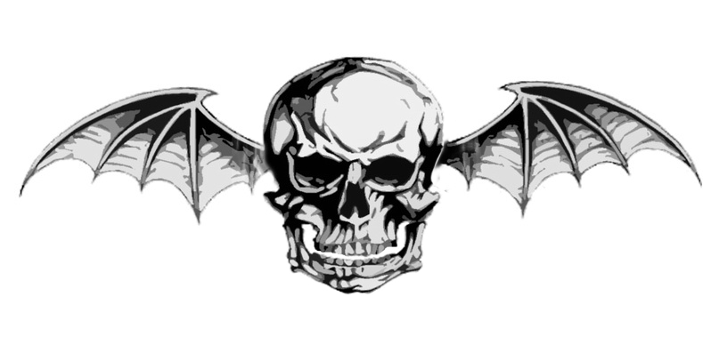

  <!-- Nama, Judul, dan Tagline -->
  <h1>Dika Ramadani</h1>
  
<strong>Web Developer from Central Java, Indonesia 🇮🇩</strong>

  
<em>Crafting elegant and functional digital experiences.</em>

  <!-- Lencana Sosial & Kontak -->
  

    
    
    
    
  

  
  <!-- GIF Animasi Utama -->
  

  

<!-- Bagian Tentang Saya & Statistik -->
<table width="100%">
  <tr>
    <td width="60%" valign="top">
      <h2 align="left">✨ About Me</h2>
      

        Seorang developer dengan hasrat untuk mengubah ide menjadi solusi digital. Saya percaya pengalaman pengguna yang hebat lahir dari perhatian terhadap detail, baik dalam kode maupun desain.
          
        Saat ini saya sedang:
        <ul>
          <li>🔭 Mengembangkan aplikasi web full-stack yang responsif.</li>
          <li>🌱 Mengeksplorasi tren teknologi baru, terutama di bidang AI dan DevOps.</li>
          <li>🤝 Terbuka untuk kolaborasi pada proyek inovatif dan open-source.</li>
        </ul>
      

    </td>
    <td width="40%" valign="top" align="center">
      <h2 align="center">📊 My GitHub Stats</h2>
      
      
    </td>
  </tr>
</table>

  

