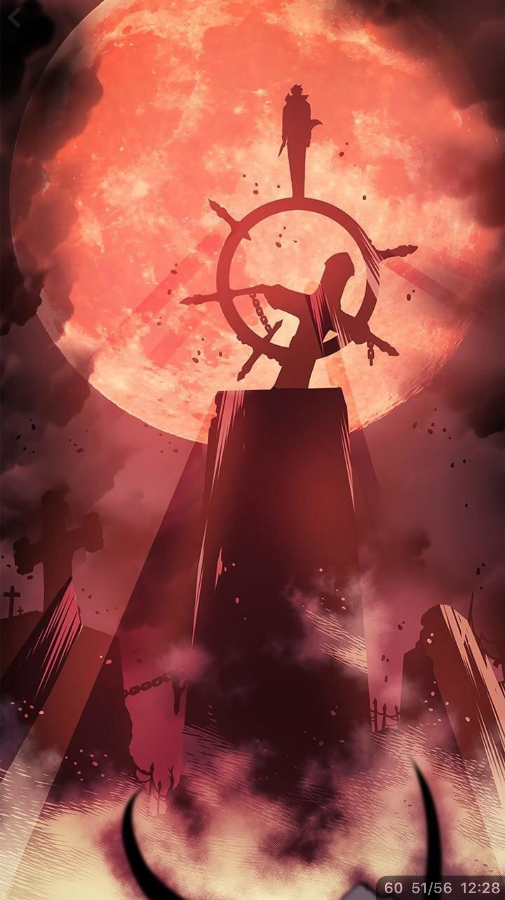

<!-- ================= HEADER BANNER ================= -->

  

  <!-- Dynamic Typing Animation -->
  

  <!-- Quick Badges -->
  

    
    
    
    
    
  

 

<!-- ================= HERO & ABOUT ME ================= -->
<table>
  <tr>
    <td width="64%" valign="top">
      <h3>🚀 Engineering Robust Systems & Seamless Interfaces</h3>
      

        Halo! Saya <strong>Dika Ramadani</strong>, seorang software engineer dengan fokus utama pada <strong>Backend Engineering & System Architecture</strong>, sekaligus memiliki kapabilitas solid dalam merancang ekosistem <strong>Full-Stack modern</strong>.
      

      

        Saya menyukai tantangan optimasi performa, integrasi API berskala tinggi, serta membangun antarmuka web yang intuitif dan responsif.
      

      <ul>
        <li>🛡️ <strong>Core Focus:</strong> Backend reliability, scalable database design, and microservices logic.</li>
        <li>⚡ <strong>Full-Stack Fluency:</strong> Seamless end-to-end integration from Next.js frontend to Rust/Laravel backend.</li>
        <li>🐧 <strong>Environment:</strong> Arch Linux & UNIX ecosystem enthusiast, leveraging terminal workflows for maximum productivity.</li>
        <li>🎯 <strong>Open For:</strong> Collaborations, challenging backend projects, and full-stack development roles.</li>
      </ul>
    </td>
    <td width="36%" align="center" valign="middle">
      
    </td>
  </tr>
</table>

 

<!-- ================= HIGHLIGHT CARDS ================= -->
### 💡 Core Pillars

<table>
  <tr>
    <td width="33.3%" align="center">
      <h4>🛡️ Backend & Systems</h4>
      
Merancang RESTful APIs berkecepatan tinggi, database relational yang terindeks efisien, dan logic sistem tangguh dengan <strong>Rust</strong>, <strong>Laravel/PHP</strong>, dan <strong>Java</strong>.

    </td>
    <td width="33.3%" align="center">
      <h4>✨ Full-Stack & UI/UX</h4>
      
Membangun pengalaman web dinamis, modular, dan modern menggunakan <strong>Next.js</strong>, <strong>JavaScript/TypeScript</strong>, dan <strong>Tailwind CSS</strong>.

    </td>
    <td width="33.3%" align="center">
      <h4>⚙️ DevOps & Ecosystem</h4>
      
Mengembangkan workflow efisien di lingkungan <strong>Arch Linux</strong>, manajemen repositori dengan <strong>Git & GitHub</strong>, serta deployment yang terstruktur.

    </td>
  </tr>
</table>

 

<!-- ================= TECH STACK MATRIX ================= -->
### 🛠️ Tech Stack & Tooling

  <table style="border: none;">
    <tr>
      <td align="right" width="25%"><strong>Backend & Systems:</strong></td>
      <td align="left">
        
      </td>
    </tr>
    <tr>
      <td align="right"><strong>Frontend & Styling:</strong></td>
      <td align="left">
        
      </td>
    </tr>
    <tr>
      <td align="right"><strong>Environment & Tools:</strong></td>
      <td align="left">
        
      </td>
    </tr>
  </table>

 

<!-- ================= GITHUB ANALYTICS ================= -->
### 📊 GitHub Activity & Metrics

  
  

  

 

<!-- ================= CONTACT & GET IN TOUCH ================= -->

  <h3>📬 Let's Connect & Collaborate</h3>
  
Tertarik mendiskusikan proyek backend, full-stack, atau peluang kolaborasi lainnya? Jangan ragu untuk terhubung!

  
  
  
  

 

<!-- ================= FOOTER ================= -->

  
  

    Designed & maintained with ⚡ by <strong>Dika Ramadani</strong>
  

